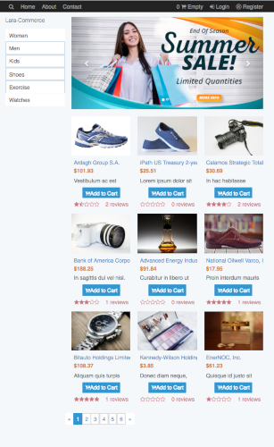
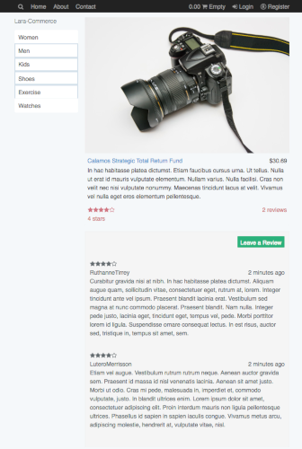

# Lara-Commerce


##
Services Available

Lara-commerce is a free e-commerce app that use the Laravel framework and Vue.   This application is currently capable of performing most the basic functions for a ecommerce application including 

- Displays live search results using Algolia 
- Accepts customer payments using stripe 
- Tested using Phpunit and Laravel  Dusk
- Customers can order products and view orders
- Full Administration section including the ability to view orders
- Upload product images

For detailed information about installation or the features please visit the documents at …

## Documentation 
View our documentation at [here](https://shawndl.github.io/LaraCommerceDocs).

## Demo
View a demo at [here](http://boiling-depths-42990.herokuapp.com/).

## Installation 
### Download
Clone the git repository:
```$xslt
git clone https://github.com/shawndl/LaraCommerce.git laracommerce
```
CD into your directory 
```$xslt
Enter the LaraCommerce director
```
### Install Dependencies
Download all php dependencies
```
composer install
```
Download all javascript dependencies 
```
npm install
```
### Set Up your local env file
In order for your project to work you need to create an .env file. The command php artisan publish:env will create an .env.example file for your project. Change the name of that file to .env before you can complete the next step.
```
php artisan publish:env
```
### Generate a application key
Next generate your app key with the following command
```
php artisan key:generate
```
### Set up your local environment
For your next step to work you need to set up your local environment. If you need any help with that you can check out any of the following links. Of course, this will work with either MAMP, WAMP, or XAMPP.

Homestead: [Laravel Homestead](https://laravel.com/docs/5.5/homestead) is an official, pre-packaged Vagrant box that provides you a wonderful development environment without requiring you to install PHP, a web server, and any other server software on your local machine.
[Say Hello to Laravel Homestead 2.0](https://laracasts.com/lessons/say-hello-to-laravel-homestead-two): If you have any trouble setting up your environment. Please check out this video on setting up homestead from laracast.